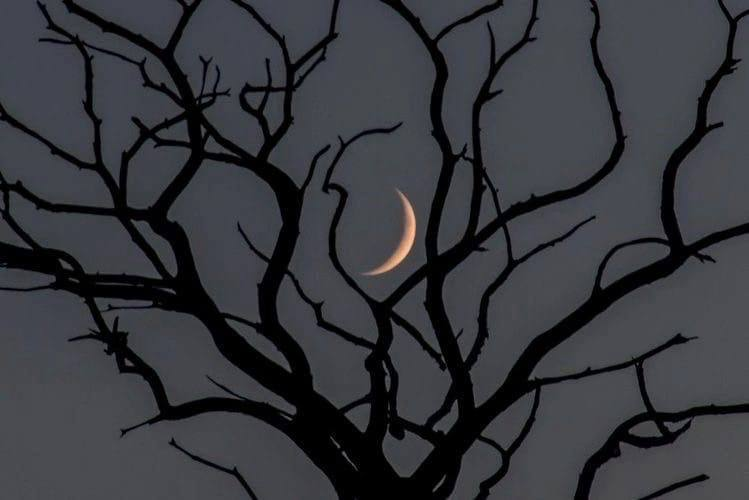

# fast_style_transfer_GAN
This is the study project within DLS courses dedicated to inference the GAN model of stylizing images (and video as bonus) via streamlit interface.

The main part of code was taken from [here](https://github.com/igreat/fast-style-transfer/tree/main) where author mentioned the original [paper](https://cs.stanford.edu/people/jcjohns/eccv16/)

The feature of this method is its fast time of inference.

In the folder `models` there are two code files. The `loss_models.py` involves the VGG16 model from torchvision.models and the content, style and TV (total variation) losses. The `transformation_models.py` file contains the main deeplearning model for applying style transfer.

In the folder `saved_models` there are the pretrained models (weights) and the mapping PRETRAINED_MODELS in the file `pretrained_models.py` corresponding for 4 styles.

In the folder `images` there are content images, style images (4 styles are pretrained) and generated images.

In the folder `videos` there are an example video `flag_kg_winter.mp4` with the stylized ones with names starting with "stylized_".

The file `app.py` is the main streamlit file.

The file `argument_parsers.py` contains the function training_parser() required in the running the `train_model.py` through the command line using argparser. In the original [work](https://github.com/igreat/fast-style-transfer/tree/main) the stylizations of image and video are to be done via command line. But in this work I deprecated these options because of the streamlit interface.

The file `stylize_image.py` contains the function for image stylization.

The file `stylize_video.py` contains the function for video stylization.

The file `train_model.py` is to be launched through command line with arguments. It loads the dataset and prepared the images, initializes the model and runs training cycle. Here is the example how to run:

`python train_model.py --style_image_path {PATH TO YOUR STYLE IMAGE} --train_dataset_path {PATH TO DATASET}`

The file `utils.py` contains functions and classes required for stylization and model training.

# Styles

  
  
  
  

# Results

  

  
  
  
  

  

  
  
  
  

  

  
  
  
  

  

  
  
  
  

  

  
  
  
  

# Video

